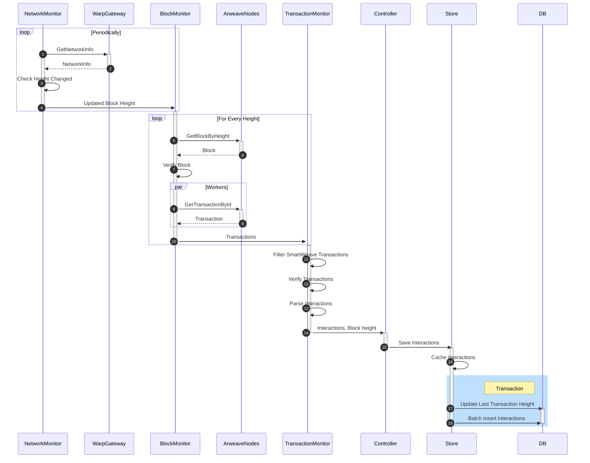

# Warp Syncer

Warp Syncer is a service for syncing with Arweave nodes. It downloads all transaction from Arweave, filters for SmartWeave contracts, parses and saves interactions to the database.

## Build
We use Make for build orchestration. To generate binaries simply use `make` in the root directory

### Local development
Seting up a local dev environment for the first time:
```sh
# Start all needed services
docker-compose up -d 

# Dump the database (only schema is needed) and save it locally
pg_dump -h ... -U ... ... | gzip > gateway_dump.gz
gunzip gateway_dump.gz
psql -U postgres -h 127.0.0.1 -p 7654 -d warp < gateway_dump

# Build and launch syncer
make run
```

### Docker
To speed up the build we're using a `vendor` dir during the build. To make it easier we added commands to the Makefile

```sh
# Build container and tag it warp.cc/syncer:latest
make docker-build

# Run container (builds it before)
make docker-run

```


## Configuration

Syncer has a default configuration that works in local development (*src/utils/config)*. To overwrite it you can a json configuration file or ENV variables:


| Environment Variable | Description |
|---|---|
| SYNCER_DBPORT | Postgres DB port |
| SYNCER_DBHOST | Postgres DB host address |
| SYNCER_DBUSER | Postgres DB user |
| SYNCER_DBPASSWORD | Postgres DB password |
| SYNCER_DBNAME | Postgres DB name |
| SYNCER_DBSSLMODE | Is SSL enabled to connect the database.  Possible values: enabled or disableds |
| SYNCER_DBPINGTIMEOUT | How much time can PING to the db take before it's considered a failure |
| SYNCER_RESTLISTENADDRESS | REST API address. API used for monitoring etc. |
| SYNCER_STOPTIMEOUT | Maximum time Syncer will be closing before stop is forced. |
| SYNCER_LOGLEVEL | Log level. Possible values: trace, debug, info, warn, error |
| SYNCER_ARNODEURL | Arweave node URL |
| SYNCER_ARREQUESTTIMEOUT | Time limit for requests. The timeout includes connection time, any redirects, and reading the response body |
| SYNCER_ARCHECKPEERTIMEOUT | Miminum time a peer needs to answer in order to be considered responsive. This should be much smaller than request timeout |
| SYNCER_ARDIALERTIMEOUT | Maximum amount of time a dial will wait for a connect to complete. |
| SYNCER_ARDIALERKEEPALIVE | Interval between keep-alive probes for an active network connection. |
| SYNCER_ARIDLECONNTIMEOUT | Maximum amount of time an idle (keep-alive) connection will remain idle before closing itself. |
| SYNCER_ARTLSHANDSHAKETIMEOUT | Maximum amount of time waiting to wait for a TLS handshake |
| SYNCER_ARLIMITERINTERVAL | Time in which max num of requests is enforced. https://ar-io.zendesk.com/hc/en-us/articles/7595655106971-arweave-net-Rate-Limits |
| SYNCER_ARLIMITERBURSTSIZE | Max num requests to particular peer per interval |
| SYNCER_ARLIMITERDECREASEFACTOR | Limit is a float numbef = max frequency per second. Whenever a HTTP 429 Too Many Requests is received we multiply limit by this factor. This way even if the limit is set too high eventually it'll get small enough. |
| SYNCER_ARLIMITERDECREASEINTERVAL | How often limiters get decreased. This timeout won't allow sudden burst to decrease the limit too much |
| SYNCER_LISTENERQUEUESIZE | Number of blocks cached before listener stops downloading new ones |
| SYNCER_LISTENERREQUIREDCONFIRMATIONBLOCKS | Minimum amount of confirmations (blocks on top of the given block) that are required to consider a given block as confirmed (i.e. not being a fork) |
| SYNCER_LISTENERNETWORKINFONODEURL | URL of the node we're using to get the current block height. It's the Warp's Gateway URL to avoid race conditions |
| SYNCER_LISTENERPERIOD | Time between requests to the Warp's Gateway for network info |
| SYNCER_LISTENERRETRYFAILEDTRANSACTIONDOWNLOADINTERVAL | Time between failed retries to download transaction |
| SYNCER_LISTENERNUMWORKERS | Number of workers that download the transactions |
| SYNCER_PEERMONITORMAXTIMEBLACKLISTED | Maximum time a peer is blacklisted. Even after this duration is over it may take some time for the peer to be re-checked |
| SYNCER_PEERMONITORMAXPEERSREMOVEDFROMBLACKLIST | Maximum number of peers that can be removed from the blacklist Peers that are blacklisted longer than `PeerMonitorMaxTimeBlacklisted` will get eventually re-used. To avoid spikes we can only remove at most this many peers from the blacklist in one try |
| SYNCER_PEERMONITORPERIOD | Time between sending monitoring requests to peers. Peers are downloaded from the arweave API and checked in parallel by couple of workers |
| SYNCER_PEERMONITORMAXPEERS | Max number of peers that can be used for retrying requests |
| SYNCER_PEERMONITORNUMWORKERS | Number of workers that check peers in parallel |
| SYNCER_STOREBATCHSIZE |Num of Interactions that are stored in the Store before being inserted into the database in one db transaction and batch. |
| SYNCER_STOREMAXTIMEINQUEUE | Maximal time interactions wait to be inserted.  After this time insert is forced. Example values: 400ms, 1s, 1m  |
| SYNCER_STOREMAXBACKOFFINTERVAL
StoreMaxBackoffInterval | Max time between failed retries to save data. |


## Architecture
### Syncing interactions from Arweave
`sync` command starts periodically monitoring the network for new blocks. Once a block is verified it downloads all its transactions, checks them and parses Smartweave interactions. Those interactions get inserted to the database. It's possible interactions from many blocks get inserted in one DB transaction, but it is **not** possible that interactions from one block get divided into different DB transactions.



### Monitoring Peers
Syncer periodically asks arweave.net for peers. It gets NetworkInfo from each peer and sorts by block height and duration of the requests.
Later whenever a request to arweave.net fails it is retried with one of the peers.

If a peer fails to respond it gets blacklisted. Blacklisted peers don't get monitored and aren't used for retrying requests. Occasionally oldest peers get removed from the blacklist and may get re-checked.

### Arweave REST API client
Syncer uses its own REST API client, heavily inspired by goar (https://github.com/everFinance/goar). It's a complete rewrite that doesn't have all the API calls added, but has:
- configurable rate limiting per each peer
- retrying requests with different peers

