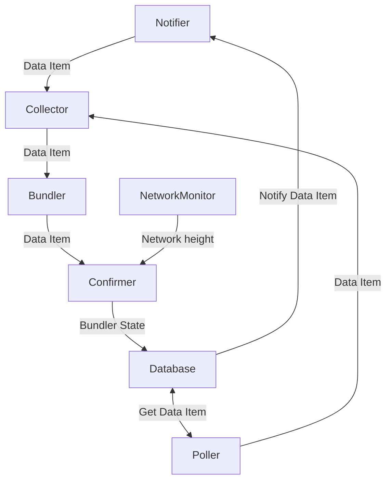

# Introduction

Bundler sends interactions to bundlr.network. Interactions are saved in a Postgres database as ANS-104 data items.
Bundler gets those data items in two ways:

- with a Postgres notification
- with polling

## Notifications

If the data item is small enough (<7900B) it fits into the notification and gets sent to bundlr.network immediately.
If it's bigger only is id is sent in the notification, and the data item is fetched from the database.
Bundler detects that it has too many data items to send and then it temporarily pauses Postgres notifications. It starts them again after it makes room in the input queue.

## Polling

Data items that don't get sent through a notification are handled by the polling mechanism. It periodically asks for unhandled data items and tries to send them to bundlr.netowrk.
Our system automatically scalles polling Bundlers in order to handle any traffic. 

## Handling errors

Bundler handles retrying if sending a data item failed. It has a backoff mechanism in case it's a temporar error, but data items are also resent by the polling mechanism.


## Run

```bash
# Start checking bundles
./syncer bundle
```

## Internals

Here are some details about how Checker works internally. Each box in the diagram is a separate `Task` that may spawn multiple goroutines, everything is set up in `src/bundle/controller.go`.



