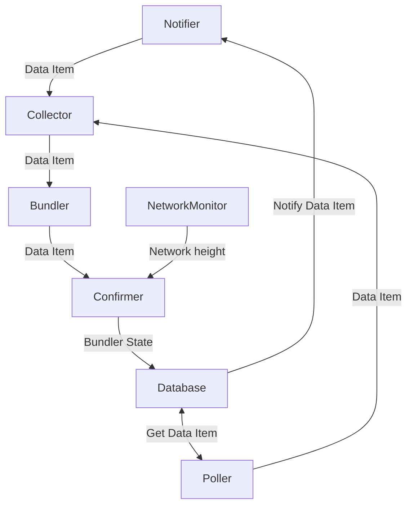

# Introduction

Bundler sends interactions to [bundlr.network](https://bundlr.network/). Interactions are saved in a Postgres database as ANS-104 DataItems.
Bundler gets those data items in two ways:

- with a Postgres notification
- with polling

## Notifications

If the DataItem is under 7900B, it fits into the notification, and it's immediately sent to bundlr.network.
For larger DataItems, only the DataItem’s ID is relayed, with the actual data retrieved from the database.
During high traffic, if the Bundler module identifies an overflow of DataItems, it temporarily pauses Postgres notifications and resumes once there's sufficient space in the input queue.

## Polling

DataItems that don't get sent through a notification are handled by the polling mechanism. It periodically asks for unhandled DataItems and tries to send them to bundlr.netowrk.
Our system dynamically scales Bundlers to accommodate any traffic volume.

## Handling errors

Bundler automatically retries if a DataItem transmission fails. It employs a backoff strategy for temporary errors, but the polling mechanism also resends DataItems.


## Run

```bash
# Start checking bundles
./syncer bundle
```

## Internals

Here are some details about how Checker works internally. Each box in the diagram is a separate `Task` that may spawn multiple goroutines, everything is set up in `src/bundle/controller.go`.



