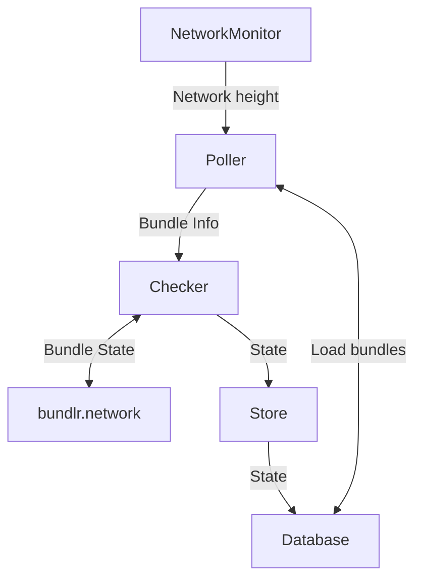

# Introduction

Checker oversees L2 interactions to ensure they ultimately seed on Arweave. Checker periodically verifies each bundle sent to bundlr.network to see if it's reached the FINISHED state. It specifically checks bundles that were created at least 160 Arweave blocks before the current block height.

## Run

```bash
# Start checking bundles
./syncer check
```

### Internals

Here's an inside look at how Checker operates. Each box in the diagram is a separate `Task` that may spawn multiple goroutines, everything is set up in `src/check/controller.go`.



