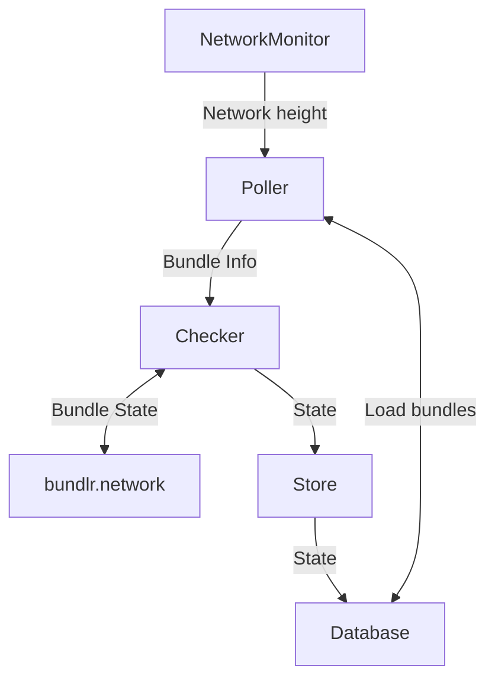

# Introduction

Checker monitors the state of L2 interactions to make sure they end up in Arweave. For each bundle sent to bundlr.network Checker periodically checks if it's already in FINISHED state. It checks bundles created sufficiently long time ago, 


## Run

```bash
# Start checking bundles
./syncer check
```

### Internals

Here are some details about how Checker works internally. Each box in the diagram is a separate `Task` that may spawn multiple goroutines, everything is set up in `src/check/controller.go`.



