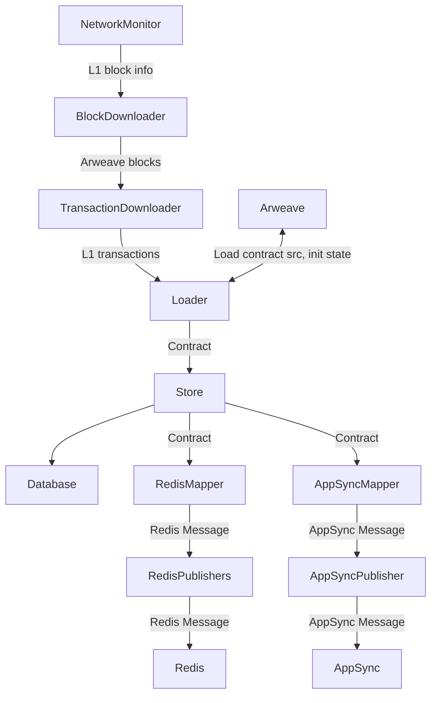

# Introduction

Contractor is the service responsible for downloading SmartWeave contracts from Arweave and saving them to a Postgres database.
It constantly monitors the Arweave network for new blocks, downloads transactions, parses contracts and saves them to the database.

## Run

```bash
# Start from the last saved block
./syncer contract

# Overwrite contracts in a range of blocks and stop
./syncer contract --start=1237269 --stop=1237269 --DANGEROUS_replace_existing_data
```

### Internals

Here are some details about how Contractor works internally. Each box in the diagram is a separate `Task` that may spawn multiple goroutines, everything is set up in `src/contract/controller.go`.



