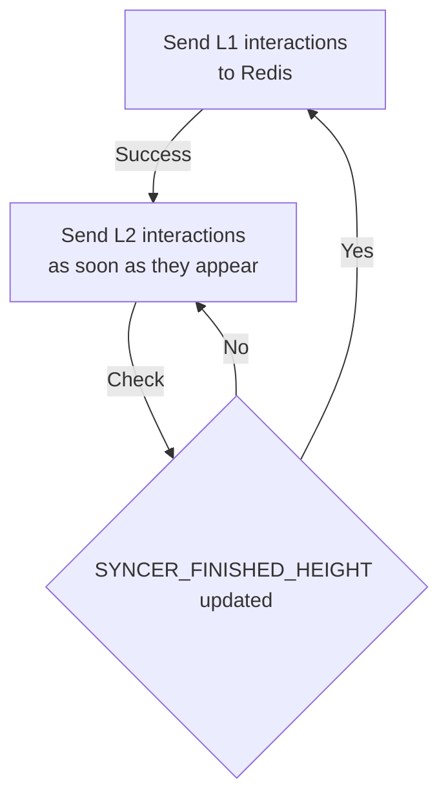
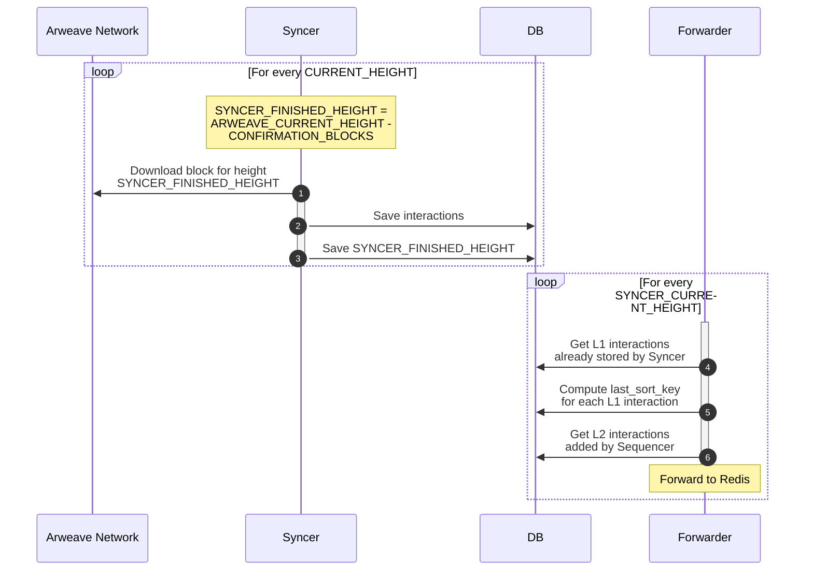
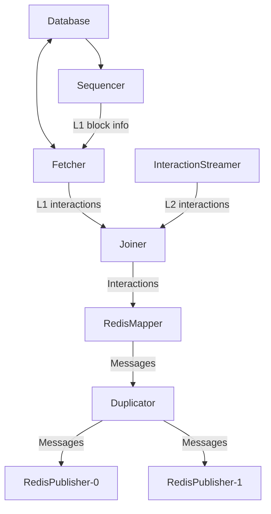

# Introduction

Forwarder is the service responsible for:

- sending L1 and L2 interactions from the database to Redis
- assigning last_sort_key to L1 interactions


## Run

```bash
# Start from the last saved block
./syncer forward
```


## Architecture

### Processing L1 interactions

Forwarder receives changes of Syncer's finished block height through Postgres notifications. This change informs that all L1 interactions from this block are saved in the database and are ready for processing. Forwarder downloads all interactions (in batches) from the database, computes `last_sort_key` for each interactions and saves all info in the database. `FORWARDER_FINISHED_HEIGHT` is updated with the last batch.


### Sending L1 and L2 interactions

L2 interactions are received asynchronously with a Postgres notification from the database and sent to Redis. If a new L1 block is detected then sending L2 interactions is paused to prevent mixing L1 and L2 in the stream. It's resumed after the last L1 interaction is sent.



### Dependency on Syncer

Forwarder works closely with Syncer in a two-stage process. Syncer downloads interactions and Forwarder processes them.



### Internals

Here are some details about how Forwarder works internally. Each box in the diagram is a separate `Task`, everything is set up in `controller.go`.



