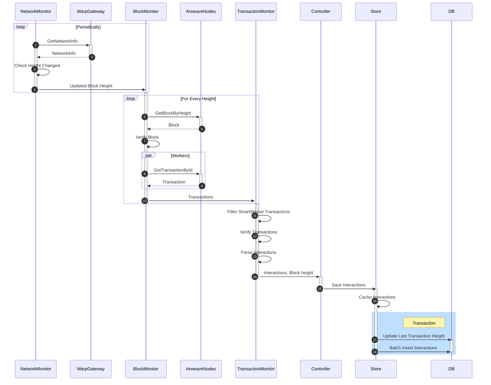

# L1 synchronization

Syncer is the service responsible for downloading SmartWeave interactions from Arweave and saving them to a Postgres database.
It constantly monitors the Arweave network for new blocks, downloads transactions, parses interactions and saves them to the database.

After each block is processed syncer modifies an entry in the `sync_state` table to indicate that the block has been processed.

## Run

```
# Start from the last saved block
./syncer sync

# Overwrite some columns in a range of blocks and stop
./syncer sync --start=1237269 --stop=1237269 --DANGEROUS_replace_existing_data
```

### Database transaction

Interactions parsed from transactions get inserted into an SQL database in batches and withing one database transaction. Interactions from many blocks **may** get inserted in one db transaction, e.g. when syncer is catching up and downloading many blocks back-to-back.  

It is **not** possible that interactions from one Arweave block get divided into different DB transactions.

Last synced block height is saved in the same database transaction as interactions from that block.

## Architecture



