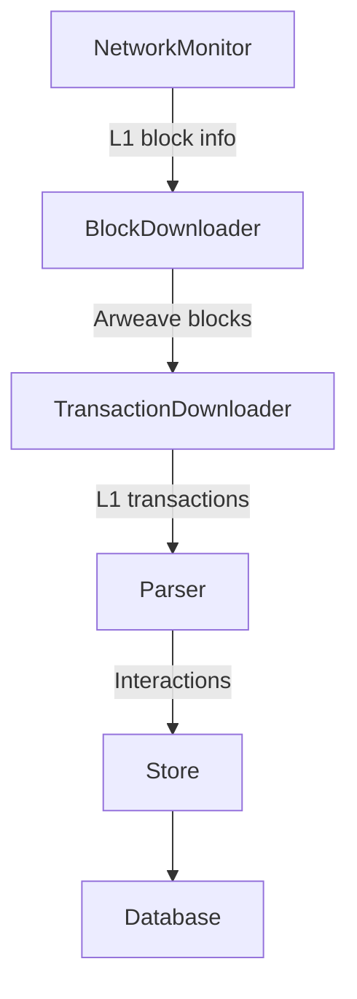

# Introduction

Syncer is the service responsible for downloading SmartWeave interactions from Arweave and saving them to a Postgres database.
It constantly monitors the Arweave network for new blocks, downloads transactions, parses interactions and saves them to the database.

## Run

```bash
# Begin from the latest saved block
./syncer sync

# Overwrite some columns within a block range and stop
./syncer sync --start=1237269 --stop=1237269 --DANGEROUS_replace_existing_data
```

## Data consistency

Interactions parsed from transactions get inserted into an SQL database in batches, within one database transaction. Interactions from many blocks **may** get inserted in one db transaction, e.g. when syncer is catching up and downloading many blocks back-to-back. It is **not** possible that interactions from one Arweave block get divided into different DB transactions.

Info about the latest synced block is saved in the same database transaction as interactions from that block.

### Internals

Here are some details about how Syncer works internally. Each box in the diagram is a separate `Task` that may spawn multiple goroutines, everything is set up in `src/sync/controller.go`.



